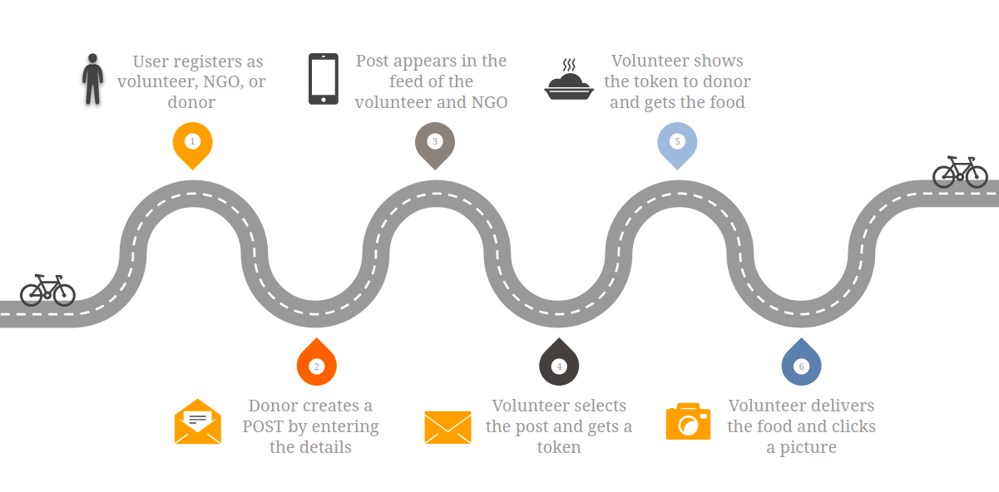
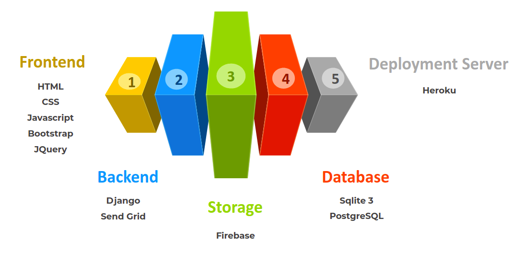
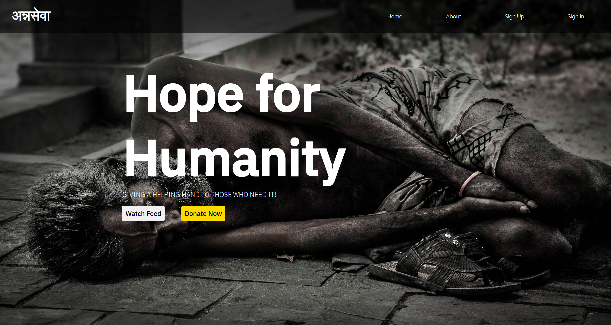
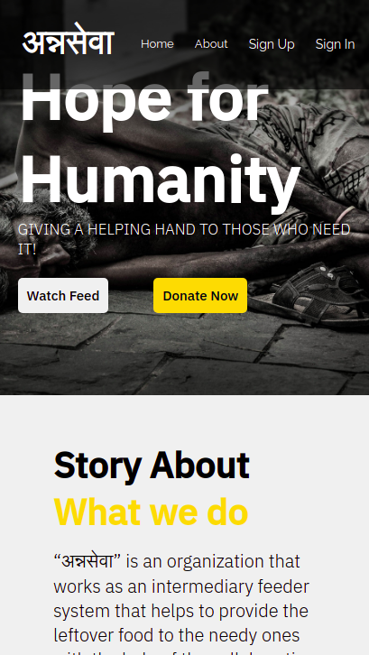

# अन्नसेवा

## Problem Statement

In India, 189.2 million people i.e., 14% of our population are undernourished. According to an estimate 19 crores of our people are forced to sleep on an empty stomach, with as many as 4500 children under the age of 5 year die due to hunger every day and this is after when India wastes a total of 40% of food produced per year according to ‘Reuters’ report. Sow we, aim to bridge the gap between hunger and food waste by introducing a web-based solution अन्नसेवा.

## Challenges Faced 

The current system of non government organizations or NGO working towards the aim of serving food to the less fortunate people of our society goes through a lot before providing the food. A continuous enquiry is needed to be done in order to acquire the leftover food from the restaurants, hotels or cafe in the city from different different regions, and this doesn’t stop there, they then have to manage the volunteers  available, as who will go where to pick-up the food and then where to drop it which ultimately require a lot of man work to be done. 

## Project Idea

अन्नसेवा is a web-based application that works as a real-time intermediary feeder system. The aim of the application is to create such a system where a user can register himself/herself as a NGO, Volunteer or Donor. After that when a donor creates a post of leftover food, the post automatically appears in the feed and also volunteers gets to be notified with whatsapp bots. Any volunteer available for that pickup location can accept the post and post will disapper from the feed and it's status is updated and a token will be generated which volunteer can show to donor for authenticity and as volunteer pickup's the food and drop it to the location provided by NGO's he will submit a picture for authenticity.

### Work Flow

## Highlighted Features

1. Automatic Feeding
2. 2 step user verification
3. Real-time feed update
4. Updates in WhatsApp bot
5. Transparency in work-flow

For more References please visit: https://docs.google.com/presentation/d/1GrLS5d7Jfw0qZgmM6dOP20NgLLlkt9TQ6f08uXctGB4/edit?usp=sharing

## Tech Stack

## Prototype View

### Desktop View

Above screenshot is the desktop view of the front page of our application.

### Mobile View

Above screenshot is the mobile view of the front page of our application.
